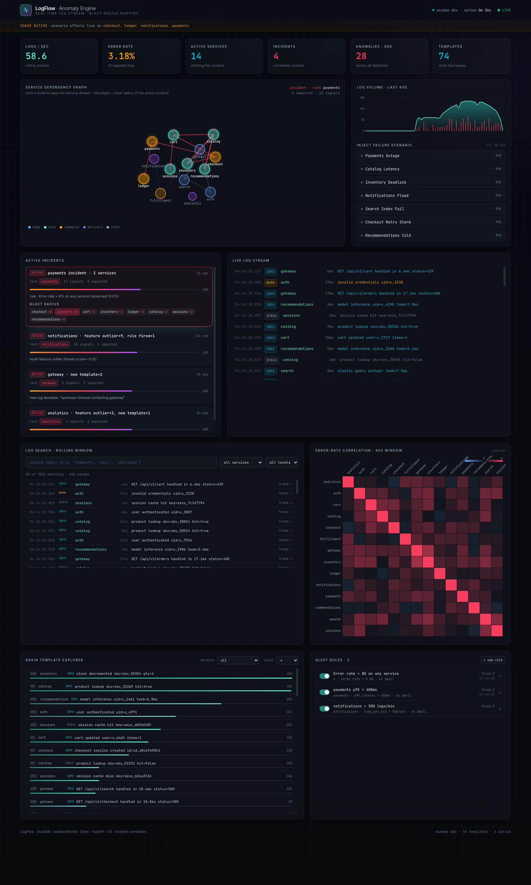

# LogFlow · Anomaly Engine

> Real-time log-stream anomaly detection with **incident correlation** and visual blast-radius mapping across service dependency graphs.



[](https://www.python.org/)
[](https://www.typescriptlang.org/)
[](https://fastapi.tiangolo.com/)
[](https://duckdb.org/)
[](LICENSE)

---

## Why this exists

Modern distributed systems emit thousands of log lines per second. When an
incident hits, on-call engineers spend the first ten minutes of an outage
answering four questions:

1. *What just changed?*
2. *Is this one problem or three?*
3. *Who is actually broken — and who is just reacting?*
4. *What's about to get hit next?*

Off-the-shelf log tools (Splunk, ELK, Datadog) answer question 1 well, but
they treat services as independent silos and they surface raw alerts, not
stories. You get fourteen separate errors across `payments`, `checkout`,
`cart`, `ledger`, and `notifications` and have to correlate them in your
head.

**LogFlow Anomaly Engine** is a standalone demo of what a blast-radius- and
story-aware log engine looks like. It ingests a live log stream, runs three
anomaly detectors in parallel, applies user-defined alert rules, infers the
service dependency graph **from the logs themselves**, clusters every
signal into **incidents**, ranks the **root cause**, projects the
downstream blast radius onto a live D3 force graph, and exposes every layer
for drill-down — trace waterfalls, per-service detail drawers, template
explorer, cross-service correlation heatmap, full-text log search, and a
live alert-rules manager.

---

## Feature highlights

### Detection & correlation
- **Rolling Z-score detector** on per-service volume, errors, and p95 latency
- **IsolationForest detector** (scikit-learn) on multi-dimensional service feature vectors
- **Drain log-template miner** (~120 LoC from scratch) detecting brand-new templates after warmup
- **Alert rules engine** with user-defined thresholds + dwell time + live CRUD
- **Incident correlation engine** that clusters signals by time + graph proximity and ranks the root service via weighted reverse BFS
- **EWMA forecaster** per service for a 10-second error-rate forecast

### Dependency modeling
- **Live service dependency graph** built incrementally from `trace_id` / parent-service co-occurrence
- **Edge decay** (configurable) so the graph reflects current behavior
- **Weighted BFS blast radius** with hop distances, bounded depth

### UI
- Full dark dashboard with a sticky header, KPI bar, and 8 interactive panels
- **Interactive D3 force graph** — click any node for a service drawer; active incident lights up its root with a pulsing ring and every edge in its blast radius turns red
- **Incident panel** — ranked active incidents, root service, state machine (active / resolving / resolved), severity bar, impacted-service chips with hop distances
- **Service drawer** — p50/p95/p99 latency sparklines, forecast, upstream/downstream callers, top templates, recent errors (click any to open its trace waterfall)
- **Trace waterfall modal** — proper span timeline for any `trace_id`
- **Drain template explorer** with live service/level filters and bar-chart counts
- **Cross-service correlation heatmap** (Pearson on per-second error rates)
- **Log search** — rolling-window full-text search with service + level filters
- **Live alert-rules manager** — toggle, add, delete rules from the UI
- **Chaos banner** showing which scenarios are currently injecting failure
- **Seven scenario injectors** — payments outage, catalog latency, inventory deadlock, notifications flood, search index failure, checkout retry storm, recommendations cold start — each with realistic downstream cascade effects

### Observability
- `/metrics` Prometheus endpoint (gauges + counters, per-service labels)

---

## Quickstart

```bash
git clone https://github.com/rayancheca/logflow-anomaly-engine.git
cd logflow-anomaly-engine
./run.sh
# → backend  http://127.0.0.1:8766
# → frontend http://127.0.0.1:5174
```

The `run.sh` launcher creates the Python venv, installs dependencies, boots
FastAPI, then boots Vite.

### Manual setup

```bash
python3 -m venv .venv
source .venv/bin/activate
pip install -r requirements.txt
uvicorn backend.main:app --host 127.0.0.1 --port 8766

# in another shell
cd frontend
npm install
npm run dev
```

### Trigger a scenario

Click any button under **Inject failure scenario**. Every scenario injects
realistic downstream cascade effects so the incident engine has something
to correlate:

| Scenario | Primary | Cascade |
|---|---|---|
| `payments_outage`       | 4.5× errors / 5× latency on `payments` | `ledger`, `checkout`, `notifications` warn |
| `catalog_latency`       | 8× p95 latency on `catalog` | `search`, `cart` warn |
| `inventory_deadlock`    | 3.5× errors on `inventory` | `checkout`, `fulfillment` warn |
| `notifications_flood`   | 5.5× warn flood on `notifications` | — |
| `search_index_fail`     | 3× errors on `search` | `gateway` warn |
| `checkout_retry_storm`  | 3.5× warn on `checkout` | `cart`, `payments` warn |
| `recommendations_cold`  | 6× latency on `recommendations` | — |

Within seconds the incident panel fills, the service graph pulses the
**root** node (not just a random symptom), and every downstream service is
highlighted with its hop distance. Click any chip to open that service's
drawer; click any error line to open its trace waterfall.

---

## Architecture

```
             ┌────────────────────┐
             │  Synthetic Log     │      (scenarios + cascade)
             │  Generator         │
             └─────────┬──────────┘
                       │ LogRecord(JSON)
                       ▼
             ┌────────────────────┐
             │  Async Stream Bus  │      (Kafka-shaped API, in-process)
             └─────────┬──────────┘
                       │
       ┌───────────────┼────────────────┐
       ▼               ▼                ▼
 ┌────────────┐  ┌─────────────┐  ┌──────────────┐
 │  DuckDB    │  │  Drain      │  │  Service     │
 │  Storage   │  │  Template   │  │  Graph       │
 │ (columnar) │  │  Miner      │  │  Builder     │
 └─────┬──────┘  └──────┬──────┘  └──────┬───────┘
       │                │                │
       └────────────────┼────────────────┘
                        ▼
              ┌────────────────────┐
              │  3-layer Anomaly   │  z-score · iforest · new-template
              │    Detector +      │
              │  Rules Engine      │  user thresholds + dwell
              └─────────┬──────────┘
                        │ Anomaly + blast_radius
                        ▼
              ┌────────────────────┐
              │  Incident Engine   │  cluster by time + graph proximity
              │  + Forecaster      │  rank root cause by reverse BFS
              └─────────┬──────────┘
                        ▼
              ┌────────────────────┐
              │  FastAPI + WS hub  │  ticks + REST deep-dive endpoints
              └─────────┬──────────┘
                        ▼
              ┌────────────────────┐
              │  React / D3        │
              │  Dashboard         │
              └────────────────────┘
```

### Tech stack

| Layer | Choice | Notes |
|---|---|---|
| Stream bus  | `asyncio.Queue` with Kafka-shaped API | swap for `confluent-kafka` by replacing one file |
| Storage     | **DuckDB**                  | embedded columnar OLAP — same execution model as ClickHouse |
| Detection   | **scikit-learn IsolationForest** + rolling Z-score + **Drain** + rules engine | four complementary paradigms |
| Correlation | Custom incident engine, reverse-BFS root-cause ranking | clusters raw anomalies into stories |
| Forecast    | EWMA (α=0.35) with running variance | cheap 10s-ahead error-rate prediction |
| API         | **FastAPI** + WebSockets + Prometheus text export | native async, single-digit-ms WS ticks |
| Frontend    | **React · TypeScript · Vite** | strict types, fast HMR |
| Styling     | **Tailwind v3** with a token palette | dark neon theme |
| Viz         | **D3.js**                   | force graph + area/line timeline + correlation heatmap + waterfall |

---

## Technical deep-dive

### 1. Log ingestion

The generator simulates a 12-service e-commerce DAG
(`gateway → auth/catalog/search → cart → checkout → payments → ledger`,
with `recommendations`, `fulfillment`, `notifications`, `analytics` and
`sessions` branching off). Each trace walks the DAG randomly, emitting a
correlated `LogRecord` per service with realistic latency, error
distributions, and parent/child linkage.

Scenarios inject a **primary degradation** plus a **cascade**: a payments
outage also poisons `ledger`, `checkout`, and `notifications` with smaller
secondary effects and a 2-second lag, so the incident engine has something
non-trivial to correlate. Without the cascade you'd just see one red node.

Records flow through a tiny Kafka-shaped pub/sub (`stream_bus.py`). Two
independent consumer groups drain the topic — one writes to DuckDB, the
other feeds the Drain miner.

### 2. Detection

**Rate detector.** A `RollingStat` keeps the last 60 samples per service
for log volume, error count, and p95 latency. On each tick we compute a
Z-score and fire a `rate_spike` if `σ ≥ 3` with a minimum absolute floor.

**Feature detector.** Every tick we build a per-service feature matrix
`[total, errors, warns, mean_lat, p95_lat, error_rate]`, take `log1p` to
dampen heavy tails, and fit a fresh `IsolationForest` with
`contamination=0.06`.

**Structural detector.** The `Drain` class is a compact ~130-line
implementation of the Drain log parsing algorithm (He et al., ICWS 2017).
Log lines are tokenised, numeric / hex / id tokens are replaced by `<*>`,
and tokens walk a fixed-depth tree to a leaf where the most similar
existing template is either merged or a new one is created. Brand-new
templates after warmup fire a `new_template` anomaly.

**Rules engine.** User-defined rules of the form
`metric op threshold for duration_s on service` fire `rule_fired`
anomalies on transition — the engine tracks per-rule dwell state so a
single transient blip doesn't page. Three defaults ship enabled:
`error_rate > 8%` (any), `payments p95 > 400ms`, `notifications > 500/min`.

### 3. Service graph + blast radius

The graph is **inferred from the logs**, not configured. Every tick we
pull the `(parent_service, service)` pairs for the current window, bump
edge weights, and decay the whole graph by `0.92` so the shape reflects
*current* traffic. Blast radius is a **weighted forward BFS** bounded to
`max_depth=4`, ignoring edges below `weight=0.1`.

### 4. Incident correlation + root cause

This is the piece that upgrades raw alerts into stories.

Two anomalies join the same incident iff they fire within a 25-second
window **and** are graph-adjacent (one's blast radius contains the other's
service, or their service sets touch). An incident holds a set of member
services and their union blast radius, transitions through an
`active → resolving → resolved` state machine, and survives for 45s after
its last signal.

**Root-cause ranking.** Failures propagate from callee → caller: when a
leaf service breaks, every upstream caller that depends on it starts
erroring. So the root cause is the most-*reached* service — the one the
other members reach by forward blast. For each member `s` we count how
many other members have `s` in their forward blast radius, tie-breaking
by average hop depth. The service with the highest score wins and gets
crowned as `root_service` — then the UI pulses *that* node, not whichever
service happened to alert first.

### 5. Deep-dive views

- **Service drawer** fetches `/api/service/{name}` every 1.5s and renders
  a latency sparkline (p50/p95/p99), forecast banner, upstream/downstream
  edge tables, top drain templates, and recent errors (each a button that
  opens the trace waterfall).
- **Trace waterfall** fetches `/api/trace/{trace_id}` and renders a
  proper span-indented timeline with per-service colour + latency labels.
- **Template explorer** polls `/api/templates` every 4s with live
  service/level filters.
- **Correlation heatmap** polls `/api/correlations` every 3.5s and draws
  a D3 Pearson heatmap across per-second error rates.
- **Log search** debounces against `/api/search` with service+level
  filters; each hit is a button that opens its trace waterfall.
- **Rules manager** reads rules from the WebSocket tick, writes back via
  `POST /api/rules`, `DELETE /api/rules/{id}`, `POST /api/rules/{id}/toggle`.

---

## API reference

| Method | Path | Purpose |
|---|---|---|
| `GET`  | `/api/health`                  | health probe |
| `GET`  | `/api/stats`                   | full `StreamMessage` snapshot |
| `GET`  | `/api/scenarios`               | list scenarios + currently active |
| `POST` | `/api/scenarios/{name}`        | inject a failure scenario |
| `GET`  | `/api/incidents`               | historical + active incidents |
| `GET`  | `/api/traces/recent`           | recent trace ids (errors_only optional) |
| `GET`  | `/api/trace/{trace_id}`        | full trace waterfall |
| `GET`  | `/api/service/{name}`          | per-service deep metrics + forecast |
| `GET`  | `/api/templates`               | drain templates with filters |
| `GET`  | `/api/search`                  | rolling-window log search |
| `GET`  | `/api/correlations`            | service × service error-rate correlation matrix |
| `GET`  | `/api/rules`                   | alert rules |
| `POST` | `/api/rules`                   | add a rule |
| `DELETE` | `/api/rules/{id}`            | delete a rule |
| `POST` | `/api/rules/{id}/toggle`       | enable/disable a rule |
| `GET`  | `/metrics`                     | Prometheus text export |
| `WS`   | `/ws/stream`                   | live push of `StreamMessage` JSON |

---

## Project layout

```
logflow-anomaly-engine/
├── backend/
│   ├── main.py            FastAPI app + REST + WebSocket + /metrics
│   ├── pipeline.py        async orchestrator (generator → bus → storage → detector → incident engine)
│   ├── generator.py       12-service log generator with cascading scenarios
│   ├── stream_bus.py      Kafka-shaped async pub/sub
│   ├── storage.py         DuckDB store + window queries, trace/search/correlation/service helpers
│   ├── drain.py           Drain log-template miner (~130 loc)
│   ├── detector.py        rolling z-score + IsolationForest + new-template
│   ├── incidents.py       incident clustering + reverse-BFS root cause
│   ├── rules.py           alert-rules engine with dwell-time transitions
│   ├── forecast.py        EWMA forecaster
│   ├── graph.py           service graph builder + blast-radius BFS
│   ├── schemas.py         Pydantic wire formats
│   └── config.py          tunables
├── frontend/
│   └── src/
│       ├── App.tsx
│       ├── hooks/useLiveStream.ts
│       └── components/
│           ├── Header.tsx
│           ├── KpiBar.tsx
│           ├── ServiceGraph.tsx
│           ├── IncidentPanel.tsx
│           ├── LogStream.tsx
│           ├── TimelineChart.tsx
│           ├── ScenarioControls.tsx
│           ├── ServiceDrawer.tsx
│           ├── TraceWaterfall.tsx
│           ├── TemplateExplorer.tsx
│           ├── CorrelationHeatmap.tsx
│           ├── SearchBar.tsx
│           └── RulesManager.tsx
├── docs/dashboard.png
├── run.sh
├── requirements.txt
└── README.md
```

---

## License

MIT.
